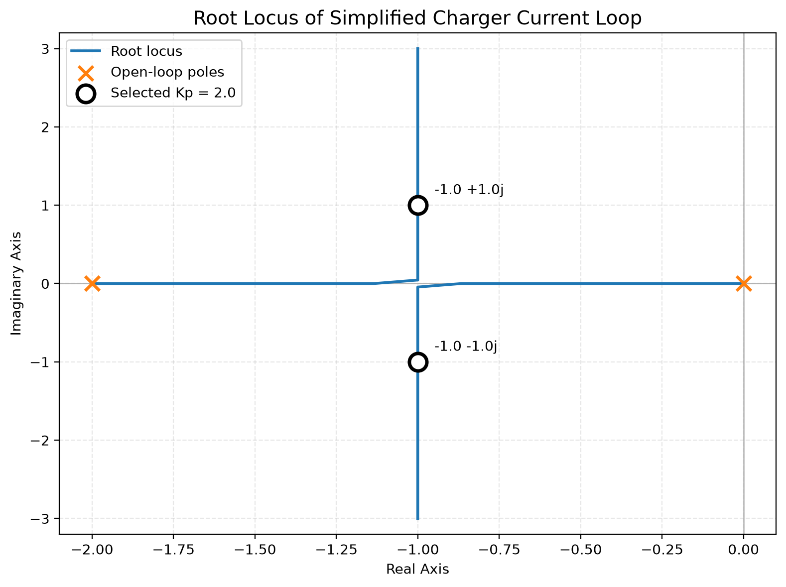

Charging Controller

Embedded C/C++ controller simulator demonstrating hardware abstraction, fault handling, watchdog supervision, CRC-protected communication, unit testing, and closed-loop control analysis.
The project separates hardware-facing C code from higher-level C++ control logic and uses a simulated hardware abstraction layer to exercise controller behavior without physical hardware.
Architecture
```text
                 Command packet
                + CRC-8 protection
                       │
                       ▼
              ┌─────────────────┐
              │    Protocol     │
              │     Layer       │
              │      (C)        │
              └────────┬────────┘
                       │
                       ▼
              ┌─────────────────┐
Sensors ─────►│       HAL       │
              │       (C)       │
              │                 │
              │ Voltage         │
              │ Current         │
              │ Temperature     │
              │ Contactor       │
              │ Watchdog        │
              └────────┬────────┘
                       │ Telemetry
                       ▼
              ┌────────────────────┐
              │ ChargingController │
              │       (C++)        │
              │                    │
              │ State machine      │
              │ Safety monitoring  │
              │ Comm timeout       │
              └─────────┬──────────┘
                        │
                        ▼
                 Contactor command


                Root-locus analysis
                  G(s), Kp, poles
                         │
                         ▼
              control\_parameters.json
                         │
                         ▼
Current reference ──► CurrentController ──► Simulated plant
                           ▲                    │
                           └──── feedback ◄─────┘
```
The HAL provides simulated sensor measurements, actuator control, communication state, and watchdog supervision.
The current-control gain is supported by a root-locus analysis of the simplified plant. Both the Python analysis and the C++ simulation read the same controller configuration, keeping the analytical design and implementation synchronized.
Safety and Fault Handling
The controller demonstrates several independent protection mechanisms:
Overcurrent → immediate fault and contactor opening
Overvoltage → immediate fault and contactor opening
Overtemperature → immediate fault and contactor opening
Communication failure → invalid CRC-protected packets accumulate toward a communication timeout
Control-task stall → watchdog independently forces the contactor open
Incoming command packets use CRC-8 validation.
During temporary packet corruption, the last valid command is retained while the controller tracks communication-loss duration. If the timeout is reached, the controller enters the fault state and opens the contactor.
Closed-Loop Current Control
The current-control demonstration uses a proportional controller with unity feedback and the simplified plant
[
G(s)=\frac{1}{s(s+2)}
]
with proportional gain (K_p).
The closed-loop transfer function is
[
T(s)
\frac{K_pG(s)}
{1+K_pG(s)}
\frac{K_p}
{s^2+2s+K_p}
]
giving the root-locus characteristic equation
[
\boxed{s^2+2s+K_p=0}
]
and closed-loop poles
[
s=-1\pm\sqrt{1-K_p}.
]
For (K_p>1),
[
s=-1\pm j\sqrt{K_p-1}.
]
Controller parameters are stored in:
```text
config/control\_parameters.json
```
Current configuration:
```json
{
  "kp": 2.0,
  "control\_period\_ms": 20
}
```
For
[
K_p=2
]
the characteristic equation becomes
[
s^2+2s+2=0
]
with closed-loop poles
[
s=-1\pm j.
]
The corresponding natural frequency is
[
\omega_n=\sqrt{2}=1.414\text{ rad/s}
]
and the damping ratio is
[
\zeta=\frac{1}{\sqrt{2}}=0.707.
]
This gives a theoretical step overshoot of approximately 4.3%, which is also visible in the simulated current response.
Root-Locus Analysis

The figure is generated by:
```text
analysis/root\_locus.py
```
It shows how the roots of
[
s^2+2s+K_p=0
]
move as (K_p) varies.
Orange × — open-loop poles at (s=-2) and (s=0)
Blue line — root locus as (K_p) varies
Black ○ — selected closed-loop poles for (K_p=2) at (s=-1\pm j)
The Python analysis reads `kp` directly from `config/control\_parameters.json`, the same configuration used by the C++ current controller.
The design flow is:
```text
Plant model
    │
    ▼
Root-locus analysis
    │
    ▼
Gain selection
    │
    ▼
control\_parameters.json
    │
    ▼
C++ CurrentController
    │
    ▼
Simulated closed-loop response
```
Unit Tests
The project includes 13 GoogleTest/CTest unit tests covering the main deterministic controller and protocol behavior.
Test coverage includes:
safe initial controller state
transition into charging
overcurrent detection
overvoltage detection
overtemperature detection
100 ms communication timeout behavior
controller reset after a fault
positive, negative, and zero current-control error
CRC-8 known reference vector
valid packet acceptance
corrupted packet rejection
Run all tests with:
```bash
ctest --test-dir build --output-on-failure
```
A successful run reports:
```text
100% tests passed, 0 tests failed out of 13
```
Build and Run
Requirements
CMake 3.24+
C11-compatible compiler
C++20-compatible compiler
Python 3 with NumPy and Matplotlib for the control analysis
Build
From the repository root:
```bash
cmake -S . -B build
cmake --build build
```
Run the Controller Simulation
Linux/macOS:
```bash
./build/ChargingController
```
Windows:
```powershell
.\\build\\ChargingController.exe
```
The executable demonstrates:
healthy controller startup
overcurrent protection
overtemperature protection
CRC-protected communication failure and timeout
watchdog-triggered safe state
closed-loop current response
Run the Unit Tests
```bash
ctest --test-dir build --output-on-failure
```
Run the Root-Locus Analysis
Install the Python dependencies:
```bash
python -m pip install numpy matplotlib
```
Run:
```bash
python analysis/root\_locus.py
```
The script reads the shared controller configuration and regenerates:
```text
analysis/root\_locus.png
```
Project Structure
```text
ChargingController/
├── .github/
│   └── workflows/
│       └── ci.yml
├── analysis/
│   ├── root\_locus.py
│   └── root\_locus.png
├── config/
│   └── control\_parameters.json
├── hal/
│   ├── hal.c
│   ├── hal.h
│   └── sim\_hal.h
├── include/
│   ├── ChargerState.hpp
│   ├── ChargingController.hpp
│   ├── CurrentController.hpp
│   ├── Fault.hpp
│   └── Telemetry.hpp
├── protocol/
│   ├── protocol.c
│   └── protocol.h
├── src/
│   ├── ChargingController.cpp
│   ├── CurrentController.cpp
│   └── main.cpp
├── tests/
│   ├── test\_charging\_controller.cpp
│   ├── test\_current\_controller.cpp
│   └── test\_protocol.cpp
├── .gitignore
└── CMakeLists.txt
```
Continuous Integration
GitHub Actions validates the project on every push and pull request to `main`.
The CI pipeline performs:
```text
Checkout repository
        ↓
CMake configure
        ↓
Build C/C++
        ↓
Run 13 unit tests with CTest
        ↓
Run full controller simulation
        ↓
CI pass
```
This provides both focused unit-level verification and a full executable smoke/integration check on a clean environment.
